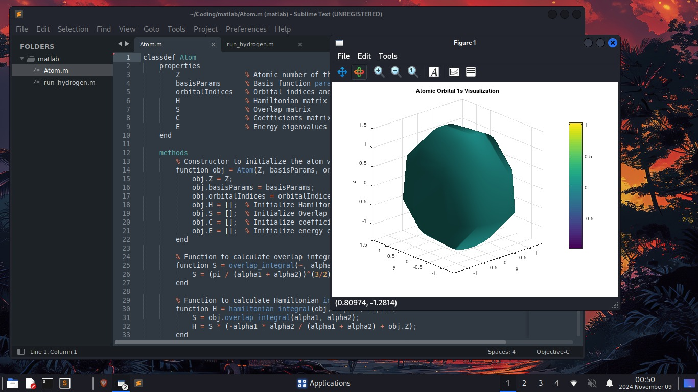

# Project Overview

The project we're working on focuses on solving the **Schrödinger time-independent equation**, a fundamental equation in quantum mechanics. This equation is essential for understanding the behavior of particles (like atoms and molecules) at the smallest, quantum level.

To explain it simply, imagine you have a ball that you're trying to understand. The Schrödinger equation tells us about the different ways the ball can move and where it's most likely to be found. In our case, instead of a ball, we're examining the behavior of the hydrogen atom, which serves as a model for understanding more complex atomic systems.

## Key Components

1. **Radial Equation**: This part of the Schrödinger equation helps us understand how the probability of finding an electron changes as you move outward from the center of an atom. For the hydrogen atom, we can visualize this by imagining it as a tiny solar system, with the nucleus at the center and the electron orbiting around it. The radial equation tells us about the likelihood of finding an electron at different distances from the nucleus.

2. **Orbital Shapes**: The solutions to the Schrödinger time-independent equation reveal various shapes that an electron's probability distribution can take, such as spheres (s orbitals), dumbbells (p orbitals), and more complex shapes (d and f orbitals). These shapes are crucial for understanding how atoms and molecules interact with each other.

## Visualization

To help visualize these concepts, our project includes functions that can generate 3D plots of the electron probability distributions for different types of orbitals in the hydrogen atom. For example:

- The **1s orbital** looks like a smooth, spherical cloud around the nucleus.
- The **2p orbital** has a dumbbell-like shape, with two distinct lobes.
- The **3d orbital** features an even more complex shape, with multiple lobes and intricate structures.

By visualizing these shapes, we can better understand how electrons behave within atoms and how atoms can form bonds to create molecules.

## Results

Here is a visual representation of our findings:

This image illustrates one of the key orbital shapes we've studied for the hydrogen atom, providing insight into the spatial distribution of electron probabilities around it.

## Conclusion

Understanding the Schrödinger time-independent equation and its implications.
