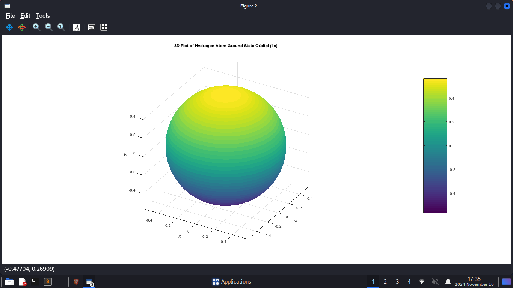
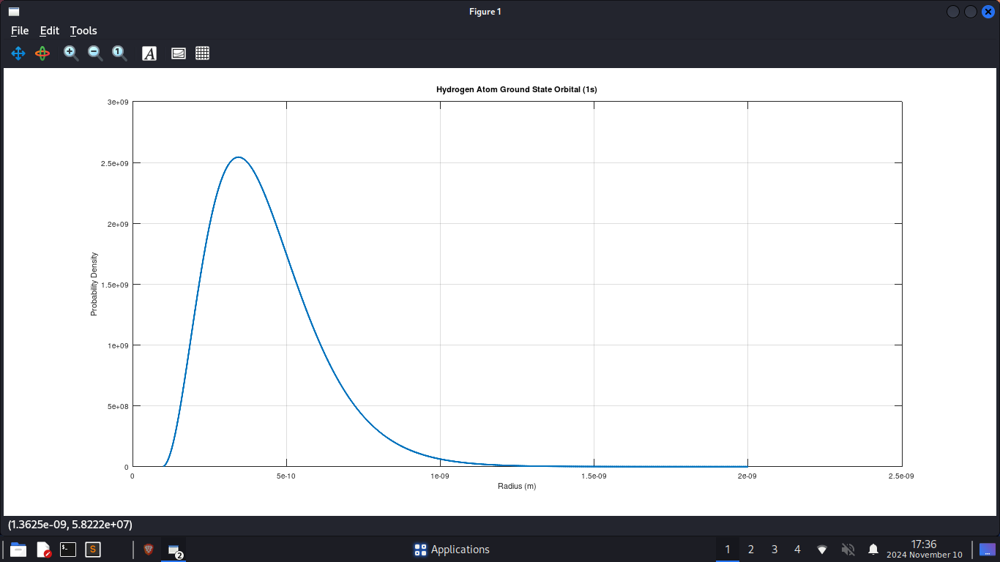

# Hydrogen Atom Ground State Simulation

## Overview
This MATLAB script simulates the ground state of a hydrogen atom using quantum mechanics principles. It calculates the wavefunctions and energy levels of the hydrogen atom, specifically focusing on the 1s orbital. The script also visualizes the probability density of the ground state wavefunction and provides a 3D representation of the orbital shape.

## Contents
- Constants and Parameters
- Hamiltonian Construction
- Eigenvalue Problem
- Probability Density Calculation
- Plotting Results
- 3D Visualization of Orbital Shape

## Requirements
- MATLAB (version R2016a or later recommended)
- Basic understanding of quantum mechanics and linear algebra

## Usage Instructions

1. **Run the Script**: Open MATLAB and copy the provided code into a new script file `Atom.m`. Run the script to perform the calculations and generate plots.

2. **View Results**:
   - The ground state energy will be printed in both Joules and electronvolts (eV).
   - A plot showing the probability density of the ground state orbital will be displayed.
   - A 3D surface plot representing the shape of the hydrogen atom's ground state orbital will also be generated.

## Code Breakdown

### Constants and Parameters
The script defines several physical constants and parameters necessary for calculations:
- `hbar`: Reduced Planck's constant (J.s)
- `e`: Elementary charge (C)
- `epsilon0`: Vacuum permittivity (F/m)
- `m_e`: Mass of an electron (kg)
- `mu`: Reduced mass for the electron-proton system
- Radial grid defined by `r_min`, `r_max`, and `N_r`.

### Hamiltonian Construction
The Hamiltonian operator is constructed using:
- Kinetic energy term (`H_kinetic`)
- Potential energy term (`H_potential`), which is derived from Coulomb's law.

### Eigenvalue Problem
The eigenvalues and eigenvectors of the Hamiltonian are computed using MATLAB's built-in `eig` function. The energies are sorted, and the ground state wavefunction is normalized.

### Probability Density Calculation
The probability density is calculated from the normalized wavefunction, which represents the likelihood of finding an electron in a given region around the nucleus.

### Plotting Results
The script generates two plots:
1. A 2D plot of the probability density as a function of radius.
2. A 3D surface plot visualizing the shape of the ground state orbital.

## Output
Upon execution, you will see:
- Ground state energy printed in Joules and eV.
- A graph displaying the probability density.
- A 3D plot illustrating the orbital shape.

## Example Output
```
Ground state energy: -4.1128e-19 J
Ground state energy: -2.5673 eV
```


## Notes
- Ensure that your MATLAB environment has access to necessary toolboxes for plotting.
- Adjust parameters such as `r_min`, `r_max`, and `N_r` for different resolutions or ranges if needed.
 
## Conclusion
This simulation provides an insightful view into quantum mechanics, illustrating how quantum states can be computed and visualized for simple atomic systems like hydrogen. Feel free to modify and expand upon this code for further exploration!
